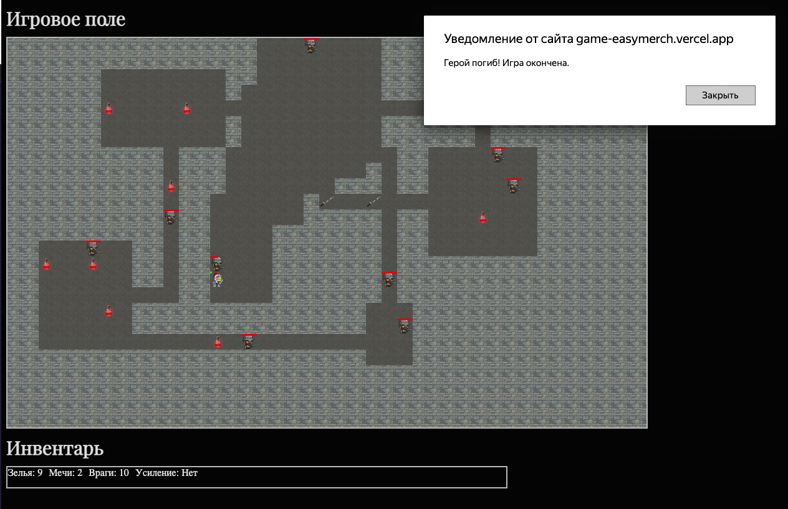

# [Игра 2D "Рогалик"](https://game-easymerch.vercel.app/)

Рогалик — это увлекательная браузерная игра с элементами рогалика. Игроку предстоит исследовать случайно сгенерированные подземелья, сражаться с врагами, находить зелья и улучшения, а также управлять здоровьем и инвентарём.

## Задачи тестового задания:
✅ Сгенерировать карту 40x24

✅ Залить всю карту стеной

✅ Разместить случайное количество (5 - 10) прямоугольных “комнат” со случайными размерами (3 - 8 клеток в длину и ширину)

✅ Разместить случайное количество (3 - 5 по каждому направлению)
вертикальных и горизонтальных проходов шириной в 1 клетку

✅ Разместить мечи (2 шт) и зелья здоровья (10 шт) в пустых местах

✅ Поместить героя в случайное пустое место

✅ Поместить 10 противников с случайные пустые места

✅ Сделать возможность передвижения героя клавишами WASD
(влево-вверх-вниз-вправо)

✅ Сделать возможность атаки клавишей пробел ВСЕХ противников
находящихся на соседних клетках

✅ Сделать атаку героя противником, если герой находится на соседней клетке с противником

✅ Сделать случайное передвижение противников (на выбор, либо передвижение по одной случайной оси, либо случайное направление каждый ход, либо поиск и атака героя)

✅ Сделать восстановление здоровья при наступлении героя на зелье
здоровья (и удаление зелья)

✅ Сделать увеличение силы удара героя при наступлении героя на меч
(и удаление меча)

## Дополнительно реализовано:

✅ Отображение инвентаря

✅ Отображение здоровья врага

✅ Уведомление о выигрыше или проигрыше

✅ Предложение начать игру заново

## Запуск

```sh
  //macOS и Linux
  open index.html
  
  // Windows
  start index.html
```

## Игра включает:

- Случайная генерация карты: каждый раз создаётся уникальное подземелье с комнатами и коридорами.
- Герой с ограниченным здоровьем, которое можно пополнять, собирая зелья.
- Враги с собственным здоровьем, которые передвигаются по карте и атакуют героя.
- Инвентарь: собирайте мечи для усиления атак и зелья для восстановления здоровья.

## Как играть:

Управление:

- W – движение вверх
- A – движение влево
- S – движение вниз
- D – движение вправо
- Пробел – атака ближайшего врага

## Цели:

Исследуйте подземелье, находите мечи и зелья.
Нападайте на врагов с помощью мечей и побеждайте их.
Собирайте зелья для восстановления здоровья.
Избегайте смертельного исхода и продолжайте сражаться за выживание!

## Основные механики:

- **Генерация карты:**
  Подземелье состоит из нескольких случайных комнат, соединённых коридорами.
  Каждая комната может содержать врагов или предметы.
- **Герой:**
  Изначально у героя 100 очков здоровья.
  Можно собирать зелья для восстановления здоровья до максимума в 100.
  Герой может собирать мечи для усиления своих атак.
- **Враги:**
  Враги обладают 20 единицами здоровья.
  Враги двигаются в случайном направлении и могут атаковать героя.
  Если здоровье врага снижается до 0, он умирает.
- **Зелья:**
  Восстанавливают 10 единиц здоровья героя при использовании.
- **Мечи:**
  Усиливают атаку героя, позволяя побеждать врагов с одного удара в течение короткого времени.

## Демо:

https://game-easymerch.vercel.app/
- **Начало игры:**

- **Герой погиб:**

- **Предложение новой игры]:**

